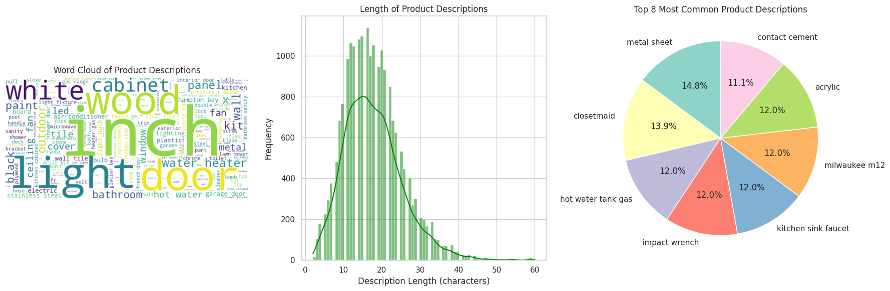
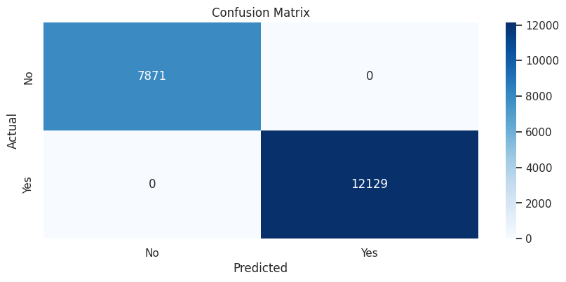
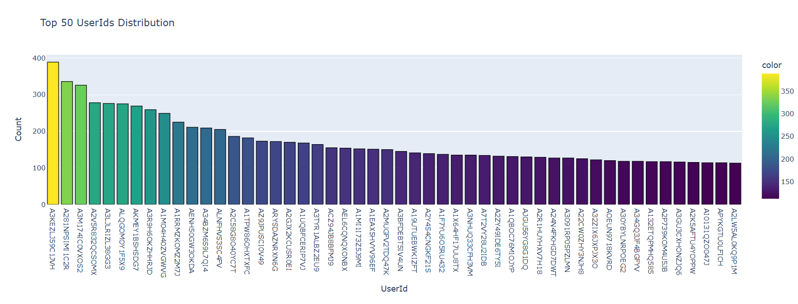
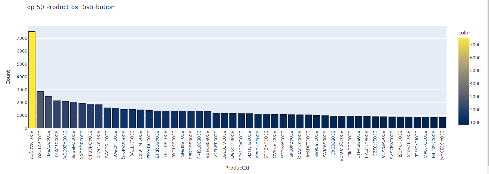
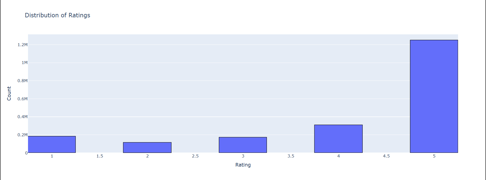

# **Next Buy : Predicting Your Next Perfect Product**

This project focuses on building a **Recommendation System for an E-commerce Platform** to enhance user experience by suggesting products. It integrates two major approaches to recommendation:  
(a) **Content-Based Filtering** — leveraging product descriptions.  
(b) **Collaborative Filtering** — utilizing user behavior, interactions, and ratings.

This project involves **Data Processing**, **Exploratory Data Analysis (EDA)**, **Model Training**, **Prediction**, and **Evaluation**. The performance of the system is measured using metrics such as **RMSE**, **Precision**, etc for assessing recommendation quality.

---

## **Methodologies Used**

### **(a) Content-Based Filtering: Using Product Descriptions**
This approach relies on product metadata to recommend items that are similar to what the user has interacted with previously.

- **Tools & Techniques**:  
  - **Cosine Similarity** or other similarity measures to compute distances between items based on their attributes.

- **Example**:  
  A user who has bought "wireless headphones" might be recommended "Bluetooth speakers" due to their similar features.

---

### **(b) Collaborative Filtering: Using User-Behavior Data**
This technique recommends items based on the past interactions of users and the behavior of other similar users.

- **Tools & Techniques**:  
  - Model 1. **Scikit-Surprise** for collaborative filtering model by SVD
  - Model 2. **Implicit Alternating Least Squares (ALS)** for advanced matrix factorization on sparse user-item interactions.

- **Example**:  
  If User A likes a product and User B likes the same product, User A might be recommended products liked by User B.

---

## **(a) Content-Based Filtering: Using Product Descriptions**

### Exploratory Data Analysis with Visualisation

#### Figure 01. (a) Most occuring words in Product descriptions, (b) Length of Product Description (c) common Product Description

### Result of Prediction 

**Precision for Content-Based Filtering**: 0.61  
**Recall for Content-Based Filtering**: 0.61
#### Figure 02. Confusion matrix for Model prediction

### Example of Model Output for Description: "angle bracket"

The following products are recommended based on the description **"angle bracket"**:

| Product_ID | Product_Name                                           | Description      |
|------------|-------------------------------------------------------|------------------|
| 1212       | Simpson Strong-Tie 12-Gauge Angle                     | angle bracket    |
| 1229       | Everbilt 1-1/2 in. Zinc-Plated Corner Brace (4-Pack)  | angle bracket    |
| 1402       | Everbilt 1 in. Zinc-Plated Corner Brace (20-Pack)     | angle bracket    |
| 1953       | Crown Bolt 1 in. x 72 in. Plain Steel Angle with Holes| angle bracket    |
| 2624       | Everbilt 3 in. Zinc-Plated Corner Brace (4-Pack)      | angle bracket    |

---

## **(b) Collaborative Filtering: Using User-Behavior Data  **

###  Exploratory Data Analysis with Visualisation
#### Figure 03. Histogram Distribution of Top 50 UserIds

#### Figure 04. Histogram Distribution of Top 50 ProductIds

### Figure 05. Distribution of Ratings

## 1. Model Evaluation Metrics for SVD Model
- **Root Mean Squared Error (RMSE):** 1.0551  
- **Mean Absolute Error (MAE):** 0.8002  
- **Precision@10:** 0.9693  
- **Accuracy@10 (Hit Ratio):** 1.0

### Recommendations for User **A22ZFXQE8AWPEP**
| **Rank** | **Product ID** | **Score**   |
|----------|----------------|-------------|
| 1        | B0023BXQXM     | 4.0525      |
| 2        | B0027895F4     | 3.9061      |
| 3        | B0011ULXB8     | 3.8202      |
| 4        | B002PU7C4K     | 3.8020      |
| 5        | B005IGXJTA     | 3.7865      |

## 2. Model Evaluation for Alternating Least Squares (ALS)
### Recommendations for Users

#### **User 354**  
- **Product ID:** B00IRMZ6S4  

#### **User 173**  
- **Product ID:** B000AO2NXS  

#### **User 4**  
- **Product ID:** B00008CMOQ  

#### **User 307**  
- **Product ID:** B001OMI93S  

--- 
## Conclusion
In conclusion, this recommendation system project successfully demonstrated two approaches: Content-Based Filtering and Collaborative Filtering, to suggest relevant products to users on an e-commerce platform. The Content-Based Filtering utilized product descriptions to match user preferences, while the Collaborative Filtering model leveraged user behaviors and ratings for personalized recommendations. Evaluation metrics such as RMSE, Precision@10, and Accuracy@10 showed promising results, with high precision and accuracy, ensuring that the recommendations align closely with user expectations. This project highlights the effectiveness of both methods in enhancing user experience and product discovery on e-commerce platforms.

# ----------------------------------------------------------------
### * If want to know more about this project there are python Notebook file and all other resources included in same repository.
### * Feel free to reach out, I'm open to engaging in meaningful conversations and exchanging ideas on these areas. I welcome the chance to explore new insights, collaborate on projects, and contribute to ongoing discussions in these fields.

